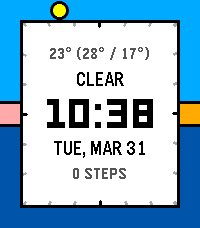
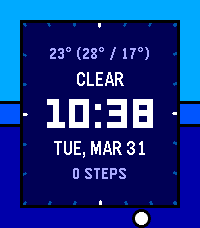

 

# Halcyon
An analog-digital watchface featuring the solar day!

Halcyon represents the 24 hours of the day as a ring around the edges of your watch, highlighting the sunrise, sunset, and the position of the sun! (Inspired by the PebbleOS 3.9-era sleep visualization!)

### Features:

- Watch the hours of your day slip away as the sun moves through the 24-hour outer dial!
- Select from various different exciting color presets, with separate themes for nighttime and daytime!
- An absolutely unreasonable amount of color customization! Create, save, load, and share custom themes!
- Widgets! Up to 4 user-selectable widgets, including weather, heartrate, steps, and more!
- Custom widgets! Add a monogram or even create your own hybrid widgets featuring any available data!
- Works in your language (experimental)! Widgets are fully localized to 38 different languages! (Note: currently experimental; if you find an error in your language, please contact me!)

### Install it on your watch: 

- **Download it on the Pebble Store:**
  - https://apps.repebble.com/halcyon_67cb1c5fb7a02301b9a6e415
- **...or on the Rebble Store:**
  - https://apps.rebble.io/en_US/application/67cb1c5fb7a02301b9a6e415
